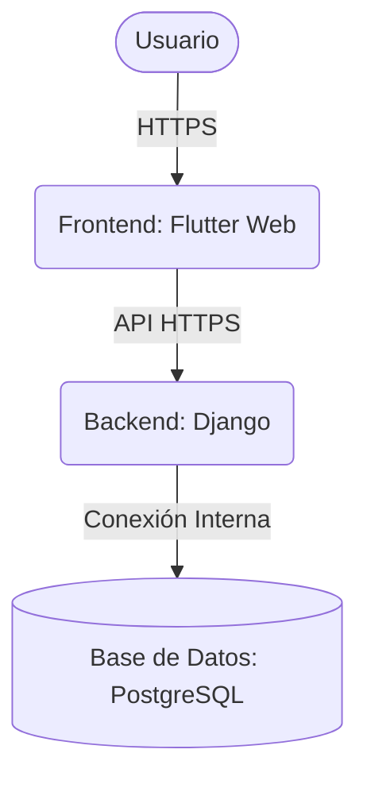

# Guía de Despliegue de EcoAlerta en Coolify 🌱

Esta guía detalla el paso a paso para desplegar la aplicación completa (**Base de Datos**, **Backend Django**, y **Frontend Flutter Web**) en tu instancia de **Coolify**.

---

## 📋 Arquitectura de Despliegue Recomendada

Para producción, se recomienda configurar **tres recursos individuales** dentro del mismo proyecto y entorno en Coolify. Esto permite aislar responsabilidades, escalar independientemente el backend/frontend, y dejar que Coolify gestione automáticamente los certificados SSL (HTTPS).



---

## 🛠️ Paso 1: Desplegar la Base de Datos (PostgreSQL)

Coolify provee bases de datos integradas "one-click" que se configuran muy fácilmente.

1. En el panel de Coolify, ve al proyecto/entorno donde deseas realizar el despliegue.
2. Haz clic en **+ New** y selecciona **Database** -> **PostgreSQL**.
3. Configura los parámetros:
   - **Name**: `ecoalerta-db`
   - **Postgres Database**: `ecoalerta`
   - **Postgres User**: `ecoalerta_user`
   - **Postgres Password**: *(Ingresa una contraseña segura)*
4. Guarda e inicia la base de datos.
5. **Copia los siguientes datos de conexión** del panel de la base de datos:
   - **Host Interno** (generalmente una dirección interna de Docker, ej. `postgresql-12345:5432`) o el nombre del servicio.
   - **Puerto Interno** (`5432`)
   - **Usuario**, **Contraseña** y **Nombre de la Base de Datos**.

---

## 🐍 Paso 2: Desplegar el Backend (Django)

El backend de Django se compilará y ejecutará usando el [Dockerfile](file:///Users/miguel/Documents/Proyectos/EcoAlerta/backend/Dockerfile) que se encuentra en la carpeta `/backend`.

1. En Coolify, haz clic en **+ New** -> **Application** -> **Public Repository** (o Private Repository si es privado).
2. Pega la URL de tu repositorio Git y la rama correspondiente.
3. Configura los ajustes de construcción:
   - **Build Pack**: Selecciona `Dockerfile`.
   - **Docker Build Path (Build Source)**: Cámbialo a `/backend` (esto es crucial para que use el Dockerfile del backend).
   - **Ports Excluded/Exposed**: Indica el puerto `8000`.
4. Asigna un dominio para la API en el campo **Domains** (ej. `https://api.ecoalerta.tudominio.com`). Coolify gestionará el certificado SSL automáticamente.
5. Ve a la pestaña **Environment Variables** (Variables de Entorno) y añade lo siguiente:
   - `DEBUG`: `False`
   - `SECRET_KEY`: *(Genera una cadena aleatoria y segura para producción)*
   - `DB_HOST`: *(El host interno de la base de datos de Coolify)*
   - `DB_NAME`: `ecoalerta`
   - `DB_USER`: `ecoalerta_user`
   - `DB_PASSWORD`: *(La contraseña que definiste en el Paso 1)*
   - `DB_PORT`: `5432`
6. Haz clic en **Deploy**. El Dockerfile se encargará automáticamente de ejecutar las migraciones (`migrate`) y cargar los datos semilla (`seed_data`) antes de iniciar con `Gunicorn`.

---

## ⚡ Paso 3: Desplegar el Frontend (Flutter Web)

El frontend de Flutter Web se compilará en Coolify usando el [Dockerfile](file:///Users/miguel/Documents/Proyectos/EcoAlerta/Dockerfile) de la raíz del proyecto y se servirá mediante **Nginx**.

1. En Coolify, haz clic en **+ New** -> **Application** -> Selecciona el mismo repositorio Git.
2. Configura los ajustes de construcción:
   - **Build Pack**: Selecciona `Dockerfile`.
   - **Docker Build Path**: Déjalo en `/` (raíz). Buscará el `Dockerfile` principal de la raíz.
   - **Ports Excluded/Exposed**: Indica el puerto `80`.
3. Asigna tu dominio principal en el campo **Domains** (ej. `https://ecoalerta.tudominio.com`).
4. Ve a la pestaña **Build Arguments** (Argumentos de Construcción) en el panel de Coolify. **(¡IMPORTANTE!)**:
   - Añade la variable `BACKEND_URL` apuntando al dominio público de tu API de Django que configuraste en el Paso 2.
   - **Ejemplo**: `BACKEND_URL=https://api.ecoalerta.tudominio.com`
5. Haz clic en **Deploy**. Coolify descargará el SDK de Flutter, compilará la versión Web inyectando el dominio del backend, y levantará el contenedor de Nginx.

---

## 🔍 Verificación del Despliegue

Una vez completado el despliegue de los 3 recursos, valida lo siguiente:
1. Accede a `https://ecoalerta.tudominio.com`. Deberías visualizar el mapa interactivo de Cerro de Pasco y el Dashboard con Glassmorphism.
2. Realiza un reporte de prueba en el mapa para confirmar que los datos se guarden correctamente en la base de datos PostgreSQL a través de la API del backend.
3. Intenta iniciar sesión como autoridad para validar que las peticiones HTTP y la autenticación por token funcionen correctamente bajo HTTPS sin errores de CORS.

---

## 💡 Consejos de Resolución de Problemas (Troubleshooting)

### ❌ Error: "Mixed Content" (Petición bloqueada por el navegador)
* **Causa**: El frontend corre bajo `https://` pero estás intentando llamar al backend usando `http://`.
* **Solución**: Asegúrate de que configuraste `BACKEND_URL` con `https://` en los **Build Arguments** del frontend en Coolify, y que volviste a desplegar la aplicación para aplicar el cambio.

### ❌ Error: "CORS (Cross-Origin Resource Sharing)"
* **Causa**: Las peticiones del dominio del frontend son rechazadas por el backend de Django.
* **Solución**: El backend en [settings.py](file:///Users/miguel/Documents/Proyectos/EcoAlerta/backend/ecoalerta_backend/settings.py) ya tiene configurado `CORS_ALLOW_ALL_ORIGINS = True`. Si prefieres restringirlo por seguridad en producción, puedes instalar `django-cors-headers` y listar explícitamente tu dominio en `CORS_ALLOWED_ORIGINS` dentro de `settings.py`.

### ❌ Las migraciones no se ejecutan o fallan al iniciar el Backend
* **Causa**: El backend intentó arrancar antes de que la base de datos PostgreSQL estuviera lista para recibir conexiones.
* **Solución**: Puedes reiniciar el servicio del backend desde el panel de Coolify para forzar un nuevo intento de conexión y migración.

---

## 💻 Configuración para Pruebas Locales (Multipass / VPS Local)

Si estás simulando el VPS en tu Mac usando **Multipass** (con la IP `192.168.252.3`), sigue estos pasos para probar sin un dominio real:

1. **Editar el archivo `/etc/hosts` en tu Mac**:
   Abre la terminal de tu Mac y edita el archivo de hosts del sistema:
   ```bash
   sudo nano /etc/hosts
   ```
   Añade la siguiente línea al final para redireccionar los dominios locales a tu VM:
   ```text
   192.168.252.3 ecoalerta.local api.ecoalerta.local
   ```
   Guarda el archivo (`Ctrl + O`, `Enter` y luego `Ctrl + X`).

2. **Configurar los dominios en Coolify**:
   * **Backend**: En el campo **Domains**, pon `http://api.ecoalerta.local` (usa `http://` en lugar de `https://`).
   * **Frontend**: En el campo **Domains**, pon `http://ecoalerta.local` (usa `http://` en lugar de `https://`).

3. **Inyectar la URL del Backend en el Frontend**:
   * En la pestaña **Build Arguments** del Frontend en Coolify, añade la variable:
     `BACKEND_URL=http://api.ecoalerta.local`

4. **Probar la aplicación**:
   * Abre tu navegador en la Mac y accede a `http://ecoalerta.local` para ver el frontend.
   * La aplicación se comunicará de forma transparente con el backend en `http://api.ecoalerta.local`.
