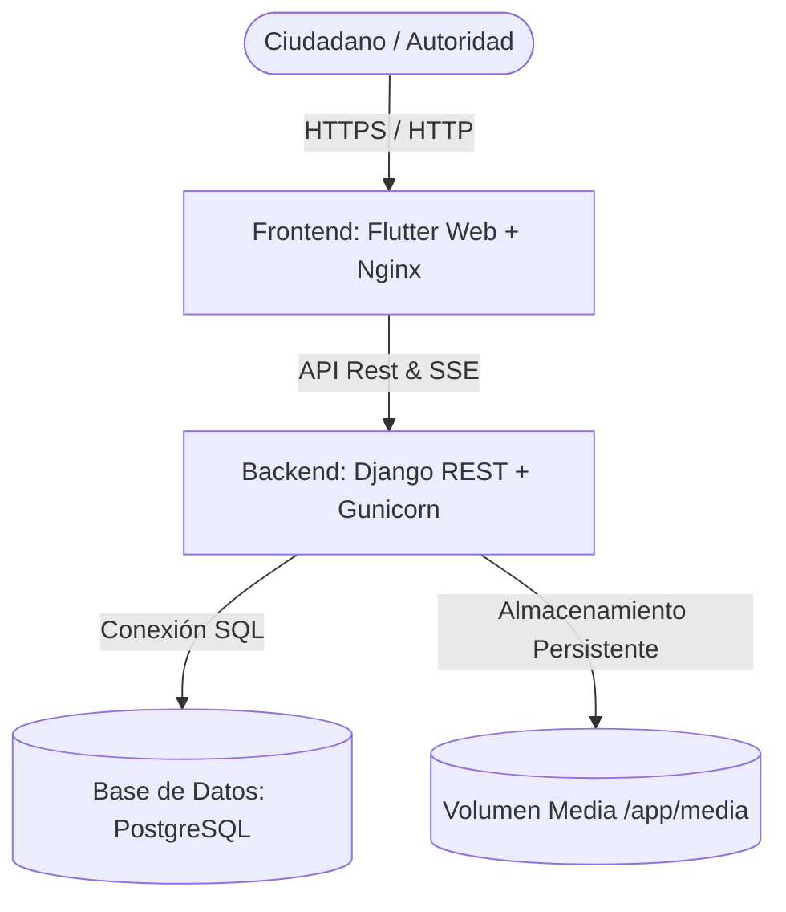
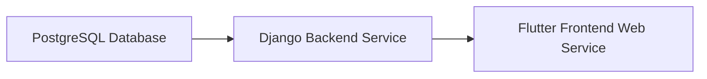

# Manual Maestro de Despliegue, Administrabilidad y Escalabilidad - EcoAlerta 🌱

Este manual contiene la guía paso a paso para el despliegue local, pruebas en **Multipass VPS (Mac con procesador Intel)**, despliegue en producción mediante **Coolify**, y las mejores prácticas para la administración y escalamiento de la plataforma **EcoAlerta Pasco**.

---

## 🏗️ 1. Arquitectura de la Aplicación y Escalabilidad

EcoAlerta está diseñada con una arquitectura desacoplada y basada en microservicios contenerizados:



### Características de Administrabilidad y Resiliencia Incorporadas:
- **Sondas de Salud (Health Checks)**:
  - Backend API: `GET /api/health/` (Comprueba conectividad activa con PostgreSQL).
  - Frontend Web: `GET /healthz` (Comprueba el servidor Nginx web).
  - PostgreSQL: `pg_isready -U ecoalerta_user -d ecoalerta`.
- **Panel de Administración Moderno**:
  - Django Unfold Admin accesible en la ruta configurable `DJANGO_ADMIN_PATH` (por defecto `/ecoalerta-secret-admin-portal/`).
- **Resiliencia al Inicio (*Wait-for-DB*)**:
  - El backend reintenta automáticamente la conexión a la base de datos hasta por 60 segundos antes de ejecutar migraciones y semillas, evitando reinicios en bucle si PostgreSQL tarda en levantar.
- **Persistencia de Archivos**:
  - Las imágenes cargadas por los ciudadanos se almacenan en el volumen `/app/media`, permitiendo mantener los archivos sin importar el redespliegue de contenedores.

---

## 💻 2. Despliegue Local con Docker Compose

Si deseas levantar la pila completa en tu máquina de desarrollo local:

### Requisitos:
- Docker Desktop instalado y corriendo.

### Pasos para iniciar:
1. Clonar el repositorio e ir a la raíz del proyecto.
2. Copiar el archivo de entorno de ejemplo:
   ```bash
   cp .env.example .env
   ```
3. Ejecutar la pila con Docker Compose:
   ```bash
   docker compose up -d --build
   ```
4. Verificar el estado de la pila y las sondas de salud:
   ```bash
   docker compose ps
   ```
5. Acceder a los servicios locales:
   - **Frontend Web**: [http://localhost:8080](http://localhost:8080)
   - **Backend API**: [http://localhost:8000/api/alerts/](http://localhost:8000/api/alerts/)
   - **Sonda de Salud Backend**: [http://localhost:8000/api/health/](http://localhost:8000/api/health/)
   - **Panel Administrador Django**: [http://localhost:8000/ecoalerta-secret-admin-portal/](http://localhost:8000/ecoalerta-secret-admin-portal/)
     - *Usuario Superadmin por defecto*: `admin`
     - *Contraseña Superadmin por defecto*: `AdminPass123!`

---

## 🖥️ 3. Configuración y Pruebas en Multipass VPS (Mac con Chip Intel)

Esta sección explica cómo probar la aplicación en una Máquina Virtual Ubuntu local administrada por **Multipass** en tu Mac Intel.

### Paso 3.1: Identificar la IP de la VM Multipass
Abre la terminal en tu Mac y consulta la IP de tu instancia de Multipass:
```bash
multipass list
```
*Ejemplo de salida:*
```text
Name                    State           IPv4            Image
vps-test                Running         192.168.252.3   Ubuntu 22.04 LTS
```
En este ejemplo, la IP de la VM es `192.168.252.3`.

### Paso 3.2: Configurar Dominios Locales en tu Mac
Para simular el entorno real con nombres de dominio en tu navegador, edita el archivo de hosts en tu Mac:
```bash
sudo nano /etc/hosts
```
Añade la siguiente línea (reemplaza `192.168.252.3` con la IP real de tu Multipass):
```text
192.168.252.3 ecoalerta.local api.ecoalerta.local
```
Guarda y sal (`Ctrl + O`, `Enter`, `Ctrl + X`).

### Paso 3.3: Ejecutar en la VM Multipass (Vía Docker Compose o Coolify)

#### Opción A: Despliegue con Docker Compose dentro de Multipass
1. Accede a la VM de Multipass:
   ```bash
   multipass shell vps-test
   ```
2. Clona o copia tu repositorio en la VM.
3. Asegúrate de configurar en el `.env`:
   ```env
   ALLOWED_HOSTS=api.ecoalerta.local,localhost,127.0.0.1
   FRONTEND_URL=http://ecoalerta.local
   BACKEND_URL=http://api.ecoalerta.local:8000
   ```
4. Ejecutar `docker compose up -d --build`.

#### Opción B: Ejecutar Coolify dentro de la VM Multipass
1. Instalar Coolify en la VM Multipass:
   ```bash
   multipass shell vps-test
   curl -fsSL https://cdn.coollabs.io/coolify/install.sh | bash
   ```
2. Accede al panel de Coolify desde el navegador de tu Mac ingresando a `http://192.168.252.3:8000`.
3. Sigue el Paso 4 de esta guía para desplegar en Coolify usando los dominios `http://ecoalerta.local` y `http://api.ecoalerta.local`.

---

## 🚀 4. Despliegue en Producción en Coolify

Coolify permite dos métodos de despliegue: **Servicios Individuales** (Recomendado) o **Docker Compose Stack**.

---

### Método 1: Servicios Individuales (Recomendado para Producción)

Permite aislamiento de fallos, escalamiento independiente y SSL automático gestionado por Traefik.



#### 1️⃣ Paso 1: Base de Datos PostgreSQL
1. En Coolify, entra a tu Proyecto/Entorno.
2. Clic en **+ New** -> **Database** -> **PostgreSQL**.
3. Parámetros:
   - **Name**: `ecoalerta-db`
   - **Postgres Database**: `ecoalerta`
   - **Postgres User**: `ecoalerta_user`
   - **Postgres Password**: *(Define una clave segura)*
4. Iniciar servicio y copiar la dirección de conexión interna (Host interno del contenedor, ej. `postgresql-12345:5432`).

#### 2️⃣ Paso 2: Backend Django
1. Clic en **+ New** -> **Application** -> **Public/Private Repository**.
2. URL de Git y rama.
3. Configuración de Build:
   - **Build Pack**: `Dockerfile`
   - **Docker Build Path**: `/backend`
   - **Ports Exposed**: `8000`
   - **Domains**: `https://api.ecoalerta.tudominio.com` (o `http://api.ecoalerta.local` en Multipass).
4. **Almacenamiento Persistente (Media)**:
   - Ir a la pestaña **Storage** -> Añadir Volumen Persistente:
     - **Name**: `ecoalerta-media`
     - **Destination Path**: `/app/media`
5. **Variables de Entorno**:
   ```env
   DEBUG=False
   SECRET_KEY=TU_SECRET_KEY_ALEATORIA_Y_SEGURA
   ALLOWED_HOSTS=api.ecoalerta.tudominio.com
   FRONTEND_URL=https://ecoalerta.tudominio.com
   CSRF_TRUSTED_ORIGINS=https://ecoalerta.tudominio.com
   DB_HOST=postgresql-12345
   DB_NAME=ecoalerta
   DB_USER=ecoalerta_user
   DB_PASSWORD=TU_POSTGRES_PASSWORD
   DB_PORT=5432
   DJANGO_ADMIN_PATH=ecoalerta-secret-admin-portal
   DJANGO_SUPERUSER_USERNAME=admin
   DJANGO_SUPERUSER_PASSWORD=TU_SUPERUSER_PASSWORD_SEGURO
   DJANGO_SUPERUSER_EMAIL=admin@ecoalerta.gov.pe
   ```
6. Clic en **Deploy**.

#### 3️⃣ Paso 3: Frontend Flutter Web
1. Clic en **+ New** -> **Application** -> Seleccionar el mismo repositorio.
2. Configuración de Build:
   - **Build Pack**: `Dockerfile`
   - **Docker Build Path**: `/` (Raíz)
   - **Ports Exposed**: `80`
   - **Domains**: `https://ecoalerta.tudominio.com` (o `http://ecoalerta.local` en Multipass).
3. **Build Arguments (Crucial)**:
   - `BACKEND_URL`: `https://api.ecoalerta.tudominio.com`
4. Clic en **Deploy**.

---

### Método 2: Despliegue en Lote (Docker Compose Stack en Coolify)

Si prefieres desplegar todo el proyecto mediante un solo archivo `docker-compose.yml`:
1. En Coolify, haz clic en **+ New** -> **Application** -> **Docker Compose**.
2. Conecta tu repositorio Git o pega directamente el contenido de `docker-compose.yml`.
3. Configura las variables de entorno en el panel de Coolify según la tabla anterior.
4. Clic en **Deploy**.

---

## 🛠️ 5. Manual de Administración y Mantenimiento

### 🔐 5.1 Acceso y Gestión de la Consola de Administración
- **Ruta de acceso**: `https://api.ecoalerta.tudominio.com/ecoalerta-secret-admin-portal/`
- **Interfaz**: Integrada con **Django Unfold**, con soporte de modo oscuro, filtros avanzados y widgets reactivos.
- **Acciones Disponibles en el Panel**:
  1. **Gestión de Alertas**: Modificar estados (Pendiente, En Proceso, Resuelto, Falso Reporte), editar respuestas oficiales de la autoridad y asignar distritos.
  2. **Gestión de Rutas de Recolección y Botaderos**: Agregar o reordenar puntos en la ruta de camiones de basura y botaderos municipales.
  3. **Configuración del Sitio**: Modificar el mensaje del banner de la ciudad, número de contacto de emergencias y estado operativo del sistema.
  4. **Gestión de Usuarios y Permisos**: Crear cuentas para nuevas autoridades de Yanacancha, Chaupimarca o Simón Bolívar.

### 📊 5.2 Monitoreo de Salud de la Infraestructura
Puedes consultar el estado del backend mediante peticiones HTTP automatizadas a:
```bash
curl -i https://api.ecoalerta.tudominio.com/api/health/
```
*Respuesta esperada (HTTP 200 OK):*
```json
{
  "status": "ok",
  "database": "connected",
  "timestamp": "2026-07-18T18:50:00.000000+00:00"
}
```

### 💾 5.3 Copia de Seguridad (Backup) de Base de Datos y Medios

#### Crear un Backup de PostgreSQL:
```bash
docker exec -t ecoalerta_db pg_dump -U ecoalerta_user ecoalerta > backup_ecoalerta_$(date +%Y%m%d).sql
```

#### Restaurar un Backup:
```bash
cat backup_ecoalerta_20260718.sql | docker exec -i ecoalerta_db psql -U ecoalerta_user -d ecoalerta
```

#### Respaldar la carpeta de imágenes (Media):
```bash
tar -czvf ecoalerta_media_backup.tar.gz ./backend/media
```

---

## ⚡ 6. Consejos de Escalabilidad Horizontal

1. **Ajuste de Concurrencia de Gunicorn**:
   Para procesar más peticiones simultáneas en el backend sin aumentar la memoria RAM drásticamente, ajusta el número de workers en el `Dockerfile` de Django usando la fórmula: `Workers = (2 * CPUs) + 1`.
2. **Uso de CDN**:
   Colocar un CDN (como Cloudflare) al frente del dominio del Frontend sirve estáticos comprimidos y reduce la latencia en más del 80%.
3. **Réplicas de Contenedores**:
   Tanto en Coolify como en Kubernetes, el contenedor del frontend (Nginx) y del backend (Django) se pueden duplicar horizontalmente gracias a que la sesión es apátrida (Stateless por Tokens).
